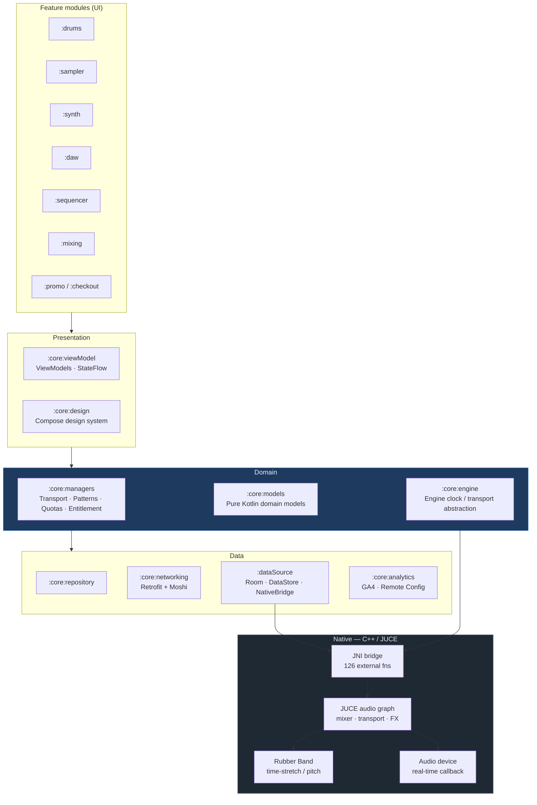

# NextSoundZ — Android Engineering Showcase

**A sanitized, public look at the engineering behind [NextSoundZ](https://nextsoundz.com) — a
production music-production studio (DAW) for Android, shipping on Google Play.**

I am the founder and the primary Android developer. I designed and built the application:
the module architecture, the Jetpack Compose UI, the Kotlin/Coroutines domain layer, the
REST and offline-sync data layer, the Google Play billing and entitlement system, the
analytics pipeline, and the JNI boundary between Kotlin and the C++/JUCE real-time audio engine.

> **This repository contains no NextSoundZ production source code.** Every sample here was
> rewritten from scratch as a simplified demonstration of an architectural pattern used in the
> real app. No credentials, endpoints, DSP algorithms, business rules, licensed audio, or
> unreleased features are included. See [What this repo is (and isn't)](#what-this-repo-is-and-isnt).

---

## 60-second overview

| | |
|---|---|
| **Product** | NextSoundZ — beat-making + multi-track DAW for Android (drum machine, sampler, synth, sequencer, mixer, stem separation, export) |
| **My role** | Founder / primary Android engineer — sole owner of the Android codebase |
| **Scale** | ~231,000 lines of Kotlin · ~63,000 lines of C++ · **37 Gradle modules** |
| **Shipping** | Live on Google Play, currently v1.5.8 · `minSdk 26` → `targetSdk 36` |
| **Stack** | Kotlin · Jetpack Compose · Coroutines/Flow · Hilt · Room · Retrofit/Moshi · WorkManager · JUCE (C++) via JNI · Firebase · Play Billing |
| **Hard parts** | Real-time audio (sub-10ms budget), a 126-method JNI surface, offline-first catalog sync, timeline/grid math, crash & ANR reduction on low-end devices |

**Where to look first:** [Architecture](#architecture) → [samples/08-native-audio-bridge](samples/08-native-audio-bridge)
(the most distinctive work) → [samples/01-clean-architecture](samples/01-clean-architecture)
(how I isolate and test business rules).

---

## What NextSoundZ is

NextSoundZ is a mobile music-production studio. A user builds a beat on a drum machine
and sampler, plays parts in from an on-screen keyboard or a hardware MIDI controller,
arranges patterns into a song on a multi-track timeline, mixes with a per-track effects
chain, and exports audio or a shareable video.

The engineering constraint that drives everything: **it is a real-time audio application on a
non-real-time OS.** Audio must be produced on a dedicated high-priority thread with a buffer
deadline measured in milliseconds, while Compose renders a 60fps timeline and the app
simultaneously downloads sample kits, syncs a catalog, and writes project state to disk.
Almost every architectural decision in this repo exists to keep work off the audio thread
and to keep the UI thread from blocking on it.

---

## Architecture

The app is a **37-module Gradle project** organized in layers. Modules depend downward only;
feature modules never depend on each other.



### The layering rules I enforce

- **`:core:models` is pure Kotlin** — no Android imports. Domain types are JVM-testable with
  plain JUnit and no Robolectric.
- **Business rules live in `:core:managers`, never in a ViewModel or a Composable.** Export
  allowances, subscription entitlement, and quota logic are plain classes with constructor
  dependencies, so each one is unit-tested in isolation. See
  [samples/01-clean-architecture](samples/01-clean-architecture).
- **ViewModels expose immutable state, never mutable engine handles.** UI observes
  `StateFlow<UiState>`; it cannot reach the audio engine directly.
- **Only `:dataSource` may call into native.** The entire JNI surface funnels through one
  `NativeBridge` object, so the Kotlin↔C++ contract has exactly one place to audit.

---

## Kotlin and Jetpack Compose

- **~231k lines of Kotlin across 1,137 files**; 143 files declare `@Composable`.
- Compose is used for the newer surfaces — the DAW timeline, the synth and sampler plugin
  screens, the automation editor, the subscribe/paywall flow, and the admin tooling — while
  older screens remain on Fragments/Views. The app is a **real, incrementally migrated
  codebase**, not a greenfield sample: I treat interop (`ComposeView`, shared ViewModels
  across both worlds) as a first-class concern rather than pretending the legacy layer is gone.
- Custom Compose work where the framework has no answer: a **scrollable, zoomable,
  multi-select timeline** with drag/resize gestures and grid snapping, and an
  **automation-lane editor** with draggable, selectable nodes.
- A shared design system in `:core:design` — theme, typography, and reusable instrument
  controls (knobs, pads, faders, meters).

See [samples/02-compose-mvvm](samples/02-compose-mvvm) for the state-hoisting and
unidirectional-data-flow pattern I use everywhere.

### A representative Compose problem I solved

Compose lambdas capture the value they close over. In the DAW timeline, a clip's gesture
handler captured the clip object at composition time, so after an edit the *stale* clip was
written back and the edit appeared to revert. The fix was to capture a stable clip **id** and
resolve the current clip from state inside the gesture, plus keying the `pointerInput` on
identity rather than on the data. This class of bug — state identity vs. value capture — is
the kind of thing that only shows up in a real app under real gestures.

---

## Java-to-Kotlin modernization

The project began as Java and is now **98.3% Kotlin by file count** (1,137 Kotlin files vs. 38
Java files remaining, and most of the remainder is one deliberately-quarantined subsystem).

My approach was not a bulk auto-convert:

1. **Convert at the boundary, not in bulk.** Files were converted as they were touched for
   feature work, so every conversion was covered by the change being made anyway.
2. **Fix nullability honestly.** IDE conversion produces `!!` and platform types everywhere.
   I replaced those with real nullability contracts, which surfaced several latent NPEs.
3. **Replace Java idioms, don't transliterate them.** Listener interfaces became `Flow`s;
   `AsyncTask`/`Thread` became coroutines; getter/setter pairs became properties; static
   utility classes became extension functions or `object`s.
4. **Leave stable, spec-defined Java alone.** The remaining Java is a MIDI file
   parser — an implementation of the Standard MIDI File binary spec. It is correct, frozen,
   heavily exercised, and has no nullability or concurrency issues. Rewriting it in Kotlin
   would be pure churn with real regression risk. **Knowing what not to migrate is part of the
   skill.**

[samples/07-java-to-kotlin](samples/07-java-to-kotlin) shows a before/after pair with the
specific defects the conversion fixed.

---

## Coroutines and asynchronous programming

Structured concurrency is the backbone of the app — 117 files declare `suspend` functions and
71 expose `StateFlow`.

- **Dispatcher discipline.** Sample decoding, waveform generation, project serialization, and
  export all run on `Dispatchers.IO` or a dedicated pool. Anything that would stall the UI or
  contend with the audio thread is moved off by construction, not by hope.
- **`Flow` as an event bus.** MIDI events, login events, and transport ticks are published as
  `SharedFlow`/`StateFlow` so multiple consumers can observe without leaking listener
  references. See [samples/03-coroutines-flow](samples/03-coroutines-flow).
- **Lifecycle-correct collection** — `repeatOnLifecycle` / `collectAsStateWithLifecycle`, so
  a backgrounded screen stops consuming engine updates.
- **Cancellation is real.** Long operations (stem separation polling, export, catalog sync)
  are cancellable and bounded; a polling loop that could strand a progress dialog is a bug I
  have actually shipped a fix for.
- **WorkManager** (`CoroutineWorker`) for deferred, constraint-driven work such as background
  catalog sync.

### Where coroutines meet real-time audio

This is the subtle part. **A coroutine cannot run on the audio thread.** The JUCE audio
callback is a hard-deadline context: no allocation, no locks, no JNI calls up into the JVM.
So the boundary works like this:

- Kotlin → native: plain, fast, non-blocking `external fun` calls that mutate engine state.
- Native → Kotlin: the engine **never** calls up during the audio callback. It posts to a
  lock-free queue drained by a scheduled clock on the JVM side, which then emits into a `Flow`.

Getting this wrong produces audio glitches that look like random UI jank. Getting it right is
most of what makes the app feel solid.

---

## Device and hardware communication (MIDI)

> **A note on scope, stated plainly:** NextSoundZ integrates **hardware MIDI controllers** via
> `android.media.midi` (USB and on-device transports). It does **not** currently implement a
> BLE GATT stack — the production manifest declares legacy Bluetooth permissions, but there is
> no Bluetooth code behind them, and I am not going to claim BLE experience this codebase does
> not demonstrate. The transferable work is real device I/O: async device discovery and
> hot-plug, binary protocol parsing, and low-latency event routing.

What the MIDI subsystem does:

- **Device lifecycle** — registers a `MidiManager.DeviceCallback` for hot-plug attach/detach,
  opens input/output ports, and tears them down cleanly on device removal.
- **Binary protocol parsing** — decodes the MIDI wire format (status byte + channel, running
  status, variable-length quantities) into typed Kotlin events: Note On/Off, Control Change,
  Pitch Bend, Aftertouch.
- **Low-latency routing** — incoming events are timestamped at input and dispatched to the
  active instrument. I traced a "late notes" bug to roughly 30ms of **Android input-dispatch
  lag**, not to my own write path, and fixed it by stamping the event at the moment of input
  rather than at the moment of persistence. Measuring before optimizing mattered: the obvious
  suspect was the wrong one.
- **Standard MIDI File I/O** — reading and writing `.mid` for import/export.

See [samples/06-midi-device-io](samples/06-midi-device-io).

---

## REST API integration

A dedicated `:core:networking` module holds **23 Retrofit service interfaces** covering the
sound-kit catalog, user profiles, the creator marketplace, collaboration, notifications,
rewards, stem separation, and storage.

- **Retrofit + Moshi**, with `suspend` functions returning typed responses — no callbacks.
- **A sealed `Result` wrapper** at the repository boundary so the UI handles
  success / network error / API error explicitly instead of catching exceptions in a ViewModel.
- **OkHttp interceptors** for auth token injection, logging (debug builds only), and retry.
- **Repository pattern** — ViewModels depend on repository interfaces, so tests inject fakes
  and never touch the network.

See [samples/04-networking-retrofit](samples/04-networking-retrofit).

### Offline-first catalog sync

Sound kits are large and users are frequently offline mid-session. The catalog is therefore
**cursor-based and incremental**: the client stores a sync cursor, asks the backend only for
changes since that cursor, and applies them to Room in a transaction. The UI always reads from
Room, so it renders instantly and identically whether or not the network is available.
This replaced a naive "re-download the whole catalog weekly" job.

See [samples/05-room-offline-sync](samples/05-room-offline-sync).

---

## Audio engine and C++/JUCE integration

This is the part of the codebase I would most want a senior Android reviewer to look at.

**Shape of the integration:** ~63,000 lines of C++ built with CMake and the NDK
(`ndkVersion 29`), wrapping a **JUCE** audio graph, with **Rubber Band** for time-stretch and
pitch-shift and **aubio** for onset detection. The Kotlin side declares **126 `external fun`
JNI methods**, funnelled through a single `NativeBridge`.

**Division of responsibility:**

| Kotlin owns | C++/JUCE owns |
|---|---|
| Project state, UI, persistence, networking | The real-time audio callback |
| Transport *intent* (play/stop/seek/tempo) | Sample playback, mixing, routing |
| Serializing project state to a native-readable form | Effects chain and parameter automation |
| Scheduling and lifecycle | Offline (faster-than-real-time) export |

**Boundary design decisions:**

- **One bridge object.** Every JNI declaration lives in one place, so ABI drift between Kotlin
  and C++ has a single audit point.
- **Coarse-grained calls.** Rather than chattering across JNI per note, the app serializes a
  whole project/arrangement state and pushes it once. JNI transitions are expensive; batching
  them keeps the audio thread fed.
- **Idempotent, memoized pushes.** Re-pushing project state used to rebuild synth presets
  unconditionally, re-decoding samples and briefly dropping audio. I added a per-track memo so
  an unchanged preset is not re-applied — a good example of a native-boundary performance bug
  with a Kotlin-side fix.
- **No native callbacks from the audio thread**, as described under Coroutines above.

**Reliability work at the boundary.** The hardest production bugs I have fixed live here.
One native **use-after-free on a voice slot** was producing three unrelated-looking crash
signatures in Play Vitals; fixing the lifetime of that one object resolved all three. Other
crash-reduction work: null-`engine` guards for calls arriving after teardown, weak references
for sound-instance callbacks, and moving synth sample decoding off the main thread to clear
ANRs.

See [samples/08-native-audio-bridge](samples/08-native-audio-bridge) for the pattern (Kotlin
declaration + C++ shim + lifetime ownership), with the DSP itself omitted.

---

## Testing strategy

**172 unit-test files and 44 instrumentation-test files**, concentrated by risk rather than
spread evenly for a coverage number.

| Layer | Approach |
|---|---|
| **Domain / business rules** | Plain JUnit against pure Kotlin. Quotas, entitlement, subscription offers, grid math, pattern editing. Fast, no Android. |
| **ViewModels** | JUnit + `mockito-kotlin` + a `TestCoroutineRule` swapping in a test dispatcher; assertions on emitted `StateFlow` states. |
| **Persistence** | Room in-memory database tests for DAOs and migrations (`exportSchema = true`, currently schema v4). |
| **Native logic** | C++ unit tests compiled on the host for scale mapping, zone behavior, FX-slot routing, and automation — the audio engine is not a black box to the test suite. |
| **UI** | Espresso and Compose UI tests on the highest-traffic flows. |

**What I actually test:** the rules that cost money or corrupt user data. Export allowances,
subscription/trial eligibility, MIDI clip registration (a clip has to be in two places or a
piano-roll edit is silently dropped), timeline grid conversion (integer rounding drifts clips
off the grid), and transport state.

**Regression discipline:** production bugs get a test that pins the behavior, and the test's
KDoc records *why* it exists. Example, paraphrased from the real suite:

> *Pins the free-export allowance shared by Beat Mode and the DAW. The count is app-wide on
> purpose: before this existed the limit lived only on the song screen, so the DAW exported
> without limit.*

That comment is worth more than the assertion. See [docs/testing-strategy.md](docs/testing-strategy.md).

---

## CI/CD

- **GitHub Actions** on every push and PR to `develop`: JDK 17 (Temurin), Gradle cache, CMake
  and NDK provisioning for the native build, `assembleDebug` and the unit-test suite.
- **Native builds are the CI bottleneck**, so the third-party native dependencies (Rubber Band,
  FFTW) are built once into a per-ABI cache rather than rebuilt per run.
- **Release**: signed AAB with `debugSymbolLevel 'full'` so native crashes symbolicate in Play
  Vitals, staged rollout, monitored against Vitals crash/ANR thresholds.
- Branch-per-issue workflow with PR and issue templates.

The workflow YAML is reproduced and annotated in [docs/ci-cd.md](docs/ci-cd.md). It is
deliberately **not** installed as a live workflow in this repo — this repo is a reading sample,
not a buildable app, and I would rather show the real config than display a green badge for a
build that isn't happening.

---

## Google Play, Billing, and Firebase

**Play Billing** — subscriptions plus one-time sound-pack purchases.

- **Play is the source of truth for trial eligibility.** A local "has used trial" flag is the
  classic way to get this wrong: it is wrong after a reinstall, wrong across devices, and
  exploitable. I query the offer set Play returns and select the offer from that.
- **Purchases survive process death.** A dropped purchase acknowledgement was a real source of
  "I paid and got nothing" reports; the flow is now resumable, and reconciliation runs on
  startup.
- **Entitlement is time-bounded and verified.** Server verification runs on a periodic clock,
  with a ceiling on how long an unverified entitlement stays valid — so a verification outage
  degrades gracefully instead of either locking out paying users or granting free access forever.
- Offer/pricing selection and quota rules are unit-tested. See
  [samples/09-billing-entitlement](samples/09-billing-entitlement) for the *shape* of the
  policy object; real thresholds, product identifiers, and pricing are omitted.

**Firebase** — Auth, Firestore/Realtime Database, Cloud Storage, Cloud Messaging, Remote Config
(feature flags and staged rollouts), Crashlytics, and **GA4 analytics**.

On analytics: I own a **conversion and retention funnel** for the DAW, with a typed key
registry (`AnalyticsTrackingKeys` / `DawFunnelKeys`) rather than stringly-typed event names, so
events are refactorable and misspellings are compile errors. A real lesson from that work:
funnels showed zero users not because of instrumentation volume but because **user identity was
set too late in the session** — the events fired before GA4 knew who the user was. Analytics
bugs are usually ordering bugs.

---

## AI-assisted engineering workflow (Claude)

I use **Claude Code** as a daily part of my workflow on this codebase, and I am deliberate
about where it helps and where it does not.

**Where it earns its place:**

- **Navigating 37 modules.** Tracing a symptom across a Compose screen → ViewModel → manager →
  `NativeBridge` → C++ is exactly the kind of wide, shallow search that is faster to delegate.
- **Java-to-Kotlin conversion review** — catching the `!!`s and platform types an automated
  conversion leaves behind.
- **Writing regression tests from a bug report**, including the "why this test exists" KDoc.
- **A persistent project memory.** I maintain a structured memory of hard-won findings — the
  root cause of a crash, why one theory was reverted, which native path registers a preset
  catalog and which does not — so a debugging session six months later starts from evidence
  instead of from scratch.
- **Rubber-ducking architecture** before writing code, especially at the JNI boundary.

**Where I keep it out of the loop:**

- **The real-time audio path.** Code inside the audio callback has non-obvious constraints
  (no allocation, no locks, no JNI) that a plausible-looking suggestion will violate silently.
  I write and review that by hand.
- **Anything a device must confirm.** Audio latency, MIDI timing, and hardware behavior are
  verified on real phones — including deliberately old ones — not accepted from a model or a
  green test run.
- **Security-relevant code.** Reviewed manually. *(This showcase repo itself was produced by an
  AI-assisted audit that found a live payment credential committed to the private repo's
  history in 2023. The finding was real and actionable — and it still needed a human to
  verify it and rotate the key.)*

**The pattern I would bring to a team:** treat the model as a fast, tireless colleague with no
accountability. Excellent for breadth, recall, and first drafts. Never the final word on
correctness, and never trusted on the parts of the system where being confidently wrong is
expensive.

---

## What this repo is (and isn't)

**It is:** a set of small, self-contained Kotlin files, each demonstrating one architectural
pattern from the production app, plus documentation of how the real system is built.

**It is not:** a buildable application, and not production source. Specifically, and on purpose:

- No API keys, tokens, signing credentials, `google-services.json`, or `.env` files.
- No production hostnames, backend endpoints, or infrastructure identifiers.
- No proprietary DSP or audio algorithms — the JNI *boundary pattern* is shown; what runs
  inside the audio callback is not.
- No real monetization thresholds, product identifiers, or pricing.
- No licensed audio content, sound kits, or artwork.
- No unreleased feature work.
- **No git history from the production repository** — this repo was initialized fresh.

Every sample was written specifically for this repository. Where a real implementation was
too sensitive to show, I rewrote it to preserve the *structure* and dropped the payload.

---

## Repository map

```
.
├── README.md                        ← you are here
├── docs/
│   ├── architecture.md              Module graph, layering rules, dependency direction
│   ├── audio-engine.md              Real-time constraints and the JNI contract
│   ├── testing-strategy.md          What I test, why, and how it's organized
│   ├── ci-cd.md                     Annotated GitHub Actions pipeline + release process
│   └── ai-assisted-workflow.md      How Claude fits into the workflow, with limits
└── samples/
    ├── 01-clean-architecture/       Testable domain policy, zero Android dependencies
    ├── 02-compose-mvvm/             Compose + StateFlow + unidirectional data flow
    ├── 03-coroutines-flow/          Flow-based event bus replacing listener interfaces
    ├── 04-networking-retrofit/      Retrofit + Moshi + sealed Result + repository
    ├── 05-room-offline-sync/        Room entities/DAO + cursor-based incremental sync
    ├── 06-midi-device-io/           Hardware device lifecycle + binary protocol parsing
    ├── 07-java-to-kotlin/           Before/after, with the defects the rewrite fixed
    ├── 08-native-audio-bridge/      Kotlin↔C++ JNI boundary and lifetime ownership
    └── 09-billing-entitlement/      Entitlement policy shape (no real thresholds)
```

---

## Contact

**Roy McQueen** — Founder & Android Engineer, NextSoundZ
[nextsoundz.com](https://nextsoundz.com)

Happy to walk through any of this in detail, including the parts that aren't in this repo.
